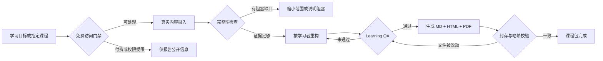

<div align="center">
  
  <h1>study-open-courses</h1>
  <p><strong>把值得学的公开课程，重建成普通人真正学得完的课程书。</strong></p>
  <p>先验证，再重构，最后才压缩。</p>

  [](https://agentskills.io/specification)
  [](SKILL.md)
  [](docs/validation/v4.1-deterministic-pipeline-results.md)
  [](LICENSE)

  [中文](#凌晨-2247你终于有空学习) · [English](#english)
</div>

---

## 凌晨 22:47，你终于有空学习

白天上班，晚上陪孩子。等家里安静下来，你只剩二十分钟。

收藏夹里躺着一门 40 小时的好课。它有名、免费、内容扎实，但视频默认你拥有整块时间：打开播放器，找回上次进度，听十分钟铺垫，再在关键例子出现时被打断。第二天重新开始，前后的逻辑已经断了。

你缺的通常不是更多课程，也不是一份把标题缩短的摘要。你需要的是另一种学习载体：

| 原来的困境 | 重建后的学习体验 |
|---|---|
| 40 小时视频，只能从头顺着看 | 按概念依赖重排的章节，随时停、明天接着学 |
| 讲师一句话带过，初学者跟不上 | 保留原教学，再加入明确标注的 AI 解释 |
| 例子、图、练习散在不同课节 | 关键例子、教学视觉和练习回到对应概念旁边 |
| 看完觉得懂了，遇到真实问题不会用 | 每个单元都有理解检查、应用和反馈线索 |
| 不知道 Agent 到底拿到了多少原始内容 | 每个结论都能回到课节、时间戳、页码或幻灯片 |

`study-open-courses` 就是为这个问题做的 Agent Skill。它寻找或接收一门合法免费可访问的课程，核对真实内容和缺口，按学习者的目标重建教学结构，再输出一套可以阅读、练习、恢复进度和追溯来源的课程书。

> **它不是“把视频变短”。它是把一段难以持续的观看过程，改造成一条能走完的学习路径。**

## 最终会拿到什么

当你要求一份正式课程时，默认交付恰好三份主文件。三份文件来自同一份 Markdown 母版，避免内容在不同格式里悄悄分叉。

```text
course-pack/
├── book-manifest.json              # 标题、语言、范围和诚实的学习时长
├── run-ledger.json                 # 可恢复的执行状态，不怕长任务中断
├── chapters/                       # 分章编写的内容母材
├── sources/                        # 合法取得的字幕、讲义与来源记录
├── evidence/
│   ├── evidence-ledger.csv         # 结论 → 课节 / 时间戳 / 页码 / 幻灯片
│   ├── concept-coverage.csv        # 每个核心概念是否真的 READY
│   ├── visual-ledger.csv           # 教学图像的来源与用途
│   └── learning-qa.json            # 学习与格式复核证据
└── dist/
    ├── course-book.md              # 完整、可编辑
    ├── course-book-standalone.html # CSS、JS、图片内联，离线可读
    └── course-book.pdf             # 适合阅读、打印与分享
```

课程正文会保留不同信息的身份：

| 标记 | 代表什么 |
|---|---|
| `Course teaching` | 讲师实际讲过或写过的内容，并带精确定位 |
| `AI explanation` | 为当前学习者重新讲解的内容 |
| `AI supplement` | 新增背景、桥接知识或额外例子 |
| `Current-context update` | 课程版本之后发生、且会影响理解的变化 |
| `Uncertain` | 尚未解决的问题，不用流畅措辞掩盖 |

## 九十秒开始

### 1. 只有目标，还没选课

```text
请使用 study-open-courses。
我是非技术背景，每周能投入 3 小时，想系统理解 AI Agent，
目标是能判断一个 Agent 工具是否真的适合自己的工作。
请先找经过验证、合法免费可访问的主学习源，说明为什么适合我，
也说明哪些信息你没有验证到。
```

### 2. 已经有一门公开课程

```text
请使用 study-open-courses 处理这套公开讲座。
我没有提前下载视频或字幕，请自行寻找合法可访问的真实教学内容，
核对课节、字幕、视觉材料和练习是否缺失或重复，
再重构成适合初学者学习的课程。
```

### 3. 要一套正式成品

```text
请把它完成为正式课程包：保留来源映射、完整性缺口、关键例子、
练习、理解检查和学习时长，交付完整 Markdown、单文件 HTML 和 PDF。
```

这会启动三文件交付契约。生成课程文件不等于获得发布权限；上传、提交、推送或发布到外部平台仍由你单独决定。

## 它怎样把“看起来完成”拦下来



### 门禁一：材料真的允许处理吗

每个可识别资源在摄入前先分类：

| 访问类别 | 处理方式 |
|---|---|
| `free_access` | 可以处理真实教学内容 |
| `paid_or_entitlement_gated` | 只报告公开元数据与社区证据，不打开课程内容 |
| `public_excerpt` | 只处理公开片段的真实覆盖范围 |
| `official_free_edition` | 作为独立版本重新核对范围与完整性 |
| `unknown` | 分类解决前停止摄入 |

购买过、已经登录、没有 DRM、只供个人使用或用户明确授权，都不会把付费教学内容变成可处理来源。这是 Skill 自己选择的工作边界。

### 门禁二：这门课值得推荐给这个人吗

热度只负责提供线索。主动推荐主学习源，需要检查持续采用、独立评价、完成反馈、专业可信度、版本时效和反方意见，并达到 **Strong** 社区验证。

进入候选后再按学习者排序：真实起点、先修知识、目标、可投入时间、语言、设备和学习方式都会改变结果。一门名气更大的进阶课，可能输给一门讲得清楚、刚好适合当前阶段的基础课。

### 门禁三：原始材料完整吗

Skill 分开核对语音、视觉、练习和附件。缺失的课节、被截断的字幕、只存在于画面里的公式、版本冲突，都要记录为阻塞或非阻塞缺口。

落地页、课程大纲、目录、评测文章和搜索摘要只能用于发现资源，不能冒充教学内容。

### 门禁四：它真的能教会人吗

Learning QA 检查概念是否讲清、例子是否足够、练习能否检验理解、前后依赖是否连续、来源能否定位，以及三种格式是否一致可用。

机械校验能确认记录、状态、覆盖数和文件没有自相矛盾；教学质量仍需要 Agent 或人实际阅读和判断。项目明确保留这条边界，不会用“测试通过”替代真实学习复核。

## v4.1：一条可以恢复、复核和封存的流水线

长课程可能跨越多次执行。`run-ledger.json` 记录每一步的真实状态：

```text
initialized
    ↓
acquired
    ↓
integrity_checked
    ↓
reconstructed
    ↓
qa_passed
    ↓
published
    ↓
sealed
```

它同时维护五个由明细记录计算出的覆盖总数：

| 字段 | 含义 |
|---|---|
| `expected` | 声明范围里本来应该有的内容 |
| `acquired` | 实际取得的内容 |
| `processed` | 已转换成可用文本、字幕或图像记录的内容 |
| `verified` | 已核对顺序、质量、截断和出处的内容 |
| `reconstructed` | 已进入最终学习单元的内容 |

只要来源、版本、范围或章节正文发生变化，旧 QA 就会变成 `stale`。最终文件再通过 SHA-256 与 QA 记录绑定；复核后偷偷改一个字，校验都会失败。

```bash
# 1. 初始化课程包和状态记录
python scripts/init_course_pack.py ./course-pack --title "课程标题"

# 2. 填充真实章节、来源、覆盖记录和 QA 证据后构建
cd course-pack
python ../scripts/build_course_book.py book-manifest.json

# 3. 实际查看 HTML 与 PDF，确认教学和渲染结果

# 4. QA 通过后封存，再做最终校验
python ../scripts/seal_course_pack.py .
python ../scripts/validate_course_pack.py .
```

> 初始化只会得到骨架，不会得到“已完成”的课程。`validate_course_pack.py` 返回非零状态，就不能把课程包称为完成。

### 这些脚本分别负责什么

| 脚本 | 责任 |
|---|---|
| [`init_course_pack.py`](scripts/init_course_pack.py) | 创建 manifest、ledger、章节和证据骨架 |
| [`build_course_book.py`](scripts/build_course_book.py) | 从章节生成权威 Markdown、HTML 与 PDF |
| [`seal_course_pack.py`](scripts/seal_course_pack.py) | 将通过的 QA 绑定到精确文件哈希 |
| [`validate_course_pack.py`](scripts/validate_course_pack.py) | 交叉检查状态、覆盖、定位、QA 与哈希 |
| [`export_pdf_cdp.js`](scripts/export_pdf_cdp.js) | 处理 PDF 书签、tagged PDF 和渲染兜底 |

构建 PDF 时，脚本会在临时打印副本中展开 `<details>` 里的答案，打印完成后删除副本。这样交付的 HTML 保留可折叠练习，PDF 又不会漏掉答案。

## 已经实际验证了什么

v4.1 当前有 8 个确定性回归场景：

1. 记录完整并正确封存的课程包可以通过；
2. 未填写的初始化骨架不能冒充完成；
3. 旧版本 QA 会被拒绝；
4. 运行时依赖远程图片的 HTML 会被拒绝；
5. QA 之后被修改的交付文件会因哈希不一致被拒绝；
6. 虚假的本地来源定位会被拒绝；
7. 本地 PNG 会被嵌入单文件 HTML；
8. 试图逃出课程包目录的 manifest 路径会被拒绝。

完整记录见 [`docs/validation/v4.1-deterministic-pipeline-results.md`](docs/validation/v4.1-deterministic-pipeline-results.md)。

这些测试证明流水线能拦截上述状态和文件错误。它们不等于一次真实长课程的端到端教学验收，也不证明所有 Agent 宿主都会作出完全相同的判断。

## 诚实地降级

如果宿主没有浏览器、PDF 渲染器、ASR 或 OCR，或者合法来源只能取得一部分，Skill 会说明：

- 哪个格式或内容被卡住；
- 缺少什么能力或来源；
- 缺口是阻塞还是非阻塞；
- 已经完成到哪个级别；
- 最小的下一步是什么。

它不会编造缺失课节、视觉解释、练习或翻译。当压缩会破坏学习，应该缩小课程范围，而不是放大完成结论。

## 安装

使用开源的 [`skills` CLI](https://github.com/vercel-labs/skills)：

```bash
npx skills add lix06231/study-open-courses -g
```

也可以指定 Agent：

```bash
npx skills add lix06231/study-open-courses -g -a codex -y
npx skills add lix06231/study-open-courses -g -a claude-code -y
npx skills add lix06231/study-open-courses -g -a gemini-cli -y
npx skills add lix06231/study-open-courses -g -a cursor -y
```

仓库遵循 [Agent Skills 规范](https://agentskills.io/specification)。目录结构和 CLI 安装是兼容的；当前核心流程与回归测试在 Codex 环境完成。Claude Code、Gemini CLI、Cursor 的完整行为仍需分别验证。

## 适合与不适合

适合：

- 从公开课程、讲座、字幕、讲义或 PDF 重建可学习的课程；
- 从目标出发寻找经过验证、适合当前学习者的免费资源；
- 把长视频课程改造成按碎片时间学习的课程书；
- 保留来源、版本、缺口、练习和复核记录；
- 为小说、纪录片等不可替代作品制作伴读、伴看或伴听材料。

不适合：

- 获取、转录或重构付费和权限受限的课程内容；
- 用摘要承诺替代文学、艺术或体验型原作；
- 只凭播放量、名校名称或一篇好评认定“最佳课程”；
- 在没有真实教学材料时，按目录猜出一门“完整课程”。

## 仓库地图

```text
study-open-courses/
├── SKILL.md                 # 核心路由、门禁和完成标准
├── references/              # 发现、画像、获取、教学、QA 与发布规范
├── scripts/                 # 初始化、构建、封存和校验工具
├── assets/                  # 课程书样式、脚本、图标与参考模板
├── tests/                   # 确定性流程回归测试
├── agents/openai.yaml       # Agent UI 元数据
├── docs/validation/         # 可追溯的验证记录
└── README.md
```

想了解 Agent 实际执行规则，请从 [`SKILL.md`](SKILL.md) 开始。构建正式课程包时，再按需阅读 [`publishing-spec.md`](references/publishing-spec.md)、[`run-ledger-schema.md`](references/run-ledger-schema.md) 和 [`learning-quality.md`](references/learning-quality.md)。

## 安全与版权边界

- 不绕过登录、付费、DRM、地区限制或平台规则；
- 不要求用户粘贴密码、Cookie、会话令牌或其他可复用凭据；
- 不把没访问到的内容写成已经核验；
- 没有相应权利时，不重新分发完整或近乎完整的版权字幕、逐字稿或 OCR 文本；
- 不用社区评论和二手评测替代课程原始教学内容；
- 未获单独授权时，不上传、提交、推送或发布到外部平台。

能够访问，不代表拥有重新分发权。课程包应以原创解释、练习、必要的少量引用和清楚的来源说明为主体。

## English

**study-open-courses turns trustworthy, legally free learning resources into course books that fit real life.**

It is designed for the learner who has twenty minutes tonight, not four uninterrupted hours. The skill can discover or accept a course, verify that its instructional content is actually accessible, check source integrity, reconstruct the teaching around a learner's goal, and publish one canonical course in three formats:

- complete Markdown;
- a literally single-file, offline-readable HTML edition;
- a complete PDF edition.

The project follows one rule: **verify first, reconstruct learning second, compress third.** Landing pages, syllabi, reviews, and search snippets are discovery metadata; they are never treated as the instructional content of a faithful course.

### The four gates

1. **Free-access gate:** paid or entitlement-gated instruction is report-only and is never ingested.
2. **Community validation and learner fit:** popularity supplies signals; it does not choose the winner.
3. **Source integrity:** speech, visuals, practice, attachments, sequence, versions, and gaps are checked separately.
4. **Learning QA:** a polished file cannot claim completion unless the teaching and format reviews are current and evidenced.

Version 4.1 adds a deterministic `init → build → review → seal → validate` pipeline. A resumable run ledger tracks coverage and state. QA becomes stale when sources, scope, revisions, or chapters change. Final files are sealed to exact SHA-256 hashes, so a post-review edit cannot silently inherit an earlier pass.

Eight regression scenarios currently verify the main mechanical failure modes. They do not replace human or model judgment about teaching quality, nor do they constitute a full cross-host behavioral evaluation.

### Install

```bash
npx skills add lix06231/study-open-courses -g
```

Then ask your Agent:

```text
Use study-open-courses to find a strongly validated, legally free course for my goal.
Explain why it fits my current level and time, disclose what you could not verify,
and build the formal three-file course pack only after the source and Learning QA gates pass.
```

The repository follows the open [Agent Skills specification](https://agentskills.io/specification). Core workflow and pipeline tests are verified in Codex. Full behavioral parity across Claude Code, Gemini CLI, Cursor, and other hosts remains to be tested independently.

## Contributing

Issues and pull requests are welcome. The most useful contributions bring a real learning scenario, a lawful-source edge case, results from an untested Agent host, or a fix that helps a person learn rather than merely process more content.

## License

[MIT](LICENSE)
